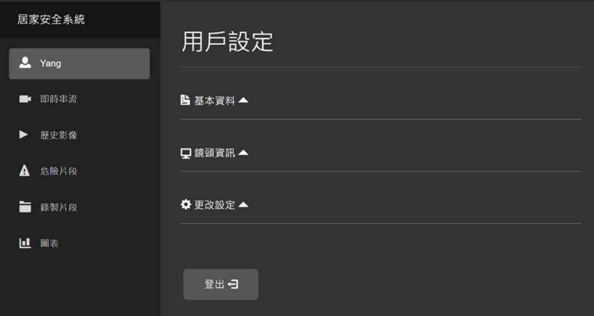
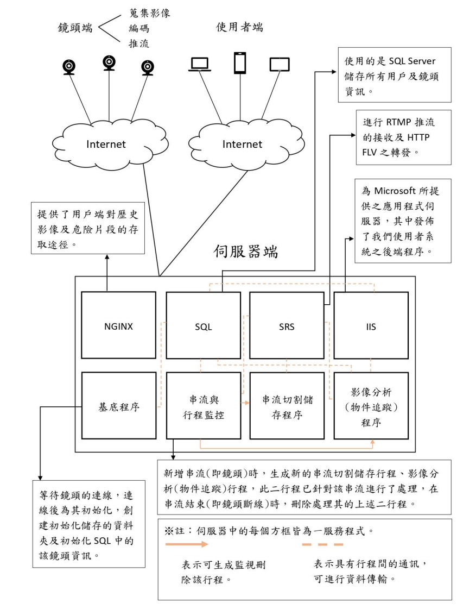
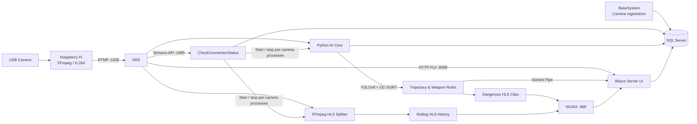
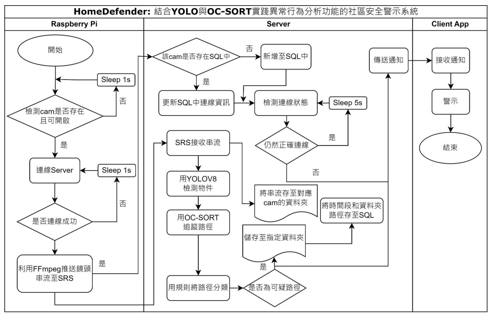
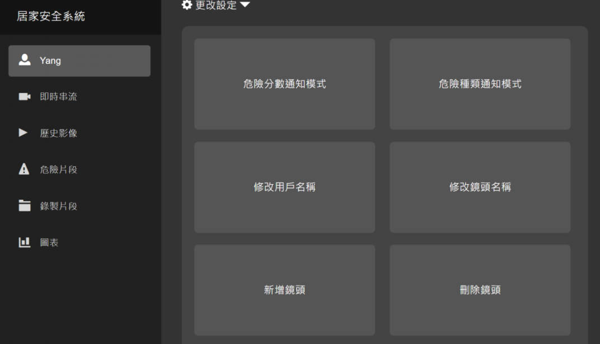

# HomeDefender

> A community security alert system combining YOLOv8, OC-SORT, real-time video streaming, and abnormal behavior analysis

[English](./README.md) | [繁體中文](./README.zh.md)

HomeDefender is an end-to-end intelligent video surveillance prototype. It consists of Raspberry Pi camera nodes, a Windows-based server, an AI video analysis core, and a Blazor Server web interface. The system receives live video, continuously tracks people, identifies suspicious trajectories and dangerous objects, and delivers real-time alerts with the corresponding video clips.

The project addresses several weaknesses of traditional surveillance: dependence on continuous human monitoring, operator fatigue, and excessive alerts produced by basic motion detection. Instead of merely detecting movement, HomeDefender analyzes whether a person is passing by, waiting, or wandering, and checks whether a bat, knife, or gun is associated with that person.

<p align="center">
  
</p>

## Features

- **Live monitoring:** Plays low-latency camera streams through HTTP-FLV.
- **Video history:** Splits streams into HLS segments for recent video playback.
- **Person tracking:** Uses YOLOv8 for detection and OC-SORT for persistent cross-frame IDs.
- **Trajectory classification:** Classifies movement as passing, waiting, or wandering using speed and direction changes.
- **Dangerous-object detection:** Detects bats, knives, and guns and associates them with nearby people.
- **Real-time alerts:** Sends AI events to subscribed web sessions through Named Pipes.
- **Automatic incident recording:** Preserves HLS segments surrounding abnormal events.
- **Manual recording:** Allows users to start and stop recording from the live-stream page.
- **Multi-user and multi-camera support:** Controls access with camera IDs and keys; cameras may be shared between users.
- **Custom notification rules:** Supports either a danger-score threshold or selected event categories.
- **Statistics:** Displays recent passing, waiting, and wandering counts for each camera.

## System Architecture

HomeDefender is divided into three major areas:

1. **Camera edge:** A Raspberry Pi captures video, encodes it as H.264, and publishes it over RTMP.
2. **Server:** SRS receives streams; a monitor starts and stops storage and AI processes according to stream state; SQL Server stores users, cameras, and events; NGINX serves recorded HLS files.
3. **User application:** Blazor Server provides account, camera, streaming, incident, recording, chart, and notification features.

<p align="center">
  
</p>

### Video and Event Data Flow



When a camera starts, it first sends its camera ID and key to `BaseSystem`. The camera begins publishing its RTMP stream only after the server has initialized its database records and storage directories.

`CheckConnectionStatus` continuously reads the SRS stream API. Whenever a stream comes online or goes offline, it starts or terminates the dedicated HLS storage and AI analysis processes for that camera.

<p align="center">
  
</p>

## AI Analysis Pipeline

Each video frame is processed approximately as follows:

1. Read a frame from the stream buffer.
2. Detect people, bats, knives, and guns with the custom YOLOv8 model.
3. Send person bounding boxes to OC-SORT to obtain persistent tracking IDs.
4. Associate weapon detections with overlapping or nearby people.
5. Classify behavior using movement speed, direction, and accumulated angle.
6. Calculate a danger score and notify sessions whose rules match the event.
7. After an abnormal person leaves the scene, assemble and preserve the full incident clip.

### Trajectory Classification

The system defines three person states:

| State | Description | Score |
| --- | --- | ---: |
| `pass` | Normal passing behavior that does not meet an abnormal condition | 0 |
| `wait` | Movement is below a dynamic speed threshold and its angle pattern indicates waiting | 3 |
| `wander` | The person remains in motion, but accumulated direction changes indicate wandering | 5 |

The final implementation primarily relies on angle changes, with speed used as supporting information:

- The first several frames of a track are ignored to reduce bounding-box instability when an object enters the image.
- Positions are sampled at fixed frame intervals and movement-angle differences are accumulated.
- Waiting requires both low speed and sufficient angular variation.
- Wandering requires continued movement and accumulated direction changes above a threshold.
- The speed threshold is dynamically adjusted according to bounding-box width to compensate for perspective and distance.

According to the project report, the early speed-extrema method achieved **82.927%** classification accuracy, while the final angle-based method achieved **95.683%**.

### Person–Weapon Association

The system does not immediately alert users when an isolated object is detected as a possible weapon. It first verifies that the weapon repeatedly overlaps or remains near a tracked person:

- A weapon event is created after at least 30 accumulated associated frames.
- Weapon confidence combines the average YOLOv8 confidence with the proportion of observed frames containing that weapon.
- If the dominant weapon category later changes and the new category exceeds the configured ratio, another notification is generated.

| Weapon | Additional score |
| --- | ---: |
| None | 0 |
| Bat | 3 |
| Knife | 4 |
| Gun | 5 |

The behavior and weapon scores are added to produce a danger score from 0 to 10. Users can choose between:

- **Score mode:** Notify when the event score exceeds a user-defined threshold.
- **Category mode:** Notify when the event contains a selected `wait`, `wander`, `bat`, `knife`, or `gun` category.

### YOLOv8 Training Results

The third model adjustment documented in the project report produced the following results:

| Class | AP50 |
| --- | ---: |
| Person | 0.864 |
| Bat | 0.797 |
| Knife | 0.544 |
| Gun | 0.980 |

> These values come from the experiments documented in the project report. They are not benchmarks automatically reproduced by each execution of this repository. Actual results depend on the dataset, model weights, hardware, stream quality, and threshold configuration.

## Web Interface

The Blazor Server application includes:

- Sign-in and registration
- User profile and notification-mode settings
- Camera registration, removal, renaming, and sharing information
- Live HTTP-FLV streaming
- HLS video history
- Automatically preserved incident clips
- Manually recorded clips
- Recent event statistics
- Real-time danger notifications displayed as toast messages

<p align="center">
  
</p>

## Repository Structure

```text
.
├── assets/                    # Architecture diagrams, workflows, and UI screenshots
├── BaseSystem/                # .NET 6 TCP camera-registration service
│   └── BaseSystem/
│       ├── Program.cs         # Registers camera ID/key and initializes SQL/storage
│       └── SocketService.cs   # Earlier socket-service experiment
├── CheckConnectionStatus/     # SRS stream and child-process lifecycle monitor
│   └── CheckConnectionStatus/
│       └── Program.cs
├── BlazorApp1/                # .NET 6 Blazor Server user interface
│   ├── Components/            # Players, forms, setting dialogs, and charts
│   ├── Data/                  # SQL, session, notification pipe, and config services
│   ├── Pages/                 # Login, live, history, incidents, recordings, charts
│   └── wwwroot/               # CSS, hls.js, mpegts.js, and frontend JavaScript
├── Core/                      # Python inference, tracking, rules, and notifications
│   ├── core.py                # Main YOLOv8 + OC-SORT inference entry point
│   ├── RiskWithAngle1.py      # Final trajectory-classification rules
│   ├── Weapon.py              # Person–weapon association and confidence accumulation
│   ├── loads.py               # Stream reading and frame buffering
│   ├── NatificationSendThread.py
│   ├── StoreDangerousFragmentThread.py
│   ├── trackers/              # OC-SORT and other trackers
│   ├── weights/               # YOLO and ReID weights
│   └── yolov8/                # Ultralytics YOLOv8 source used by the project
└── RaspberryPiC/              # Raspberry Pi Linux C/C++ edge client
    └── RaspberryPiC/
        ├── main.cpp           # Registration, reconnection, and FFmpeg publishing
        └── config.example.txt # Server IP, port, camera ID, and key template
```

## Technology Stack

| Area | Technologies |
| --- | --- |
| Edge | Raspberry Pi, Linux, C/C++, V4L2, FFmpeg |
| Streaming | RTMP, HTTP-FLV, HLS, SRS, NGINX |
| AI | Python, PyTorch, YOLOv8, OC-SORT, OpenCV, NumPy |
| Server | .NET 6, C#, SQL Server, Named Pipes, FFmpeg |
| Web | ASP.NET Core Blazor Server, hls.js, mpegts.js, Chart.js |
| Original deployment | Windows Server and IIS |

## Deployment Requirements

This repository contains a complete research-prototype source snapshot, but it is currently **not a one-command deployment**. A full environment requires:

- Windows Server
- .NET 6 SDK or Runtime
- SQL Server
- SRS for RTMP, the HTTP API, and HTTP-FLV
- NGINX for serving HLS files
- FFmpeg and FFprobe
- Python 3.9
- PyTorch; an NVIDIA GPU with matching CUDA support is recommended for real-time analysis
- Raspberry Pi, a UVC/V4L2 camera, and Raspberry Pi OS

Model files are managed with Git LFS:

```bash
git lfs install
git lfs pull
```

In addition to packages listed in `Core/requirements.txt`, the project-specific Python code uses:

```bash
pip install pymssql pythonnet ffmpeg-python
```

### External or Missing Deployment Resources

The current source snapshot does not include the following required resources:

- SQL Server schema and initialization scripts
- Production SRS configuration and TLS certificates
- Production NGINX configuration and TLS certificates
- The `SubprocessHandler` source project
- The complete HLS storage process launched by `SubprocessHandler`

`CheckConnectionStatus.csproj` currently references:

```text
../../SubprocessHandler/SubprocessHandler/SubprocessHandler.csproj
```

That project is not present in this repository. Before building this module, restore the original project or reimplement its `Runner` and `Killer` responsibilities for starting and stopping each camera's AI and HLS processes.

## Configuration

Copy `.env.example` into your preferred local environment configuration and replace its sample values. Secret-bearing local files are excluded by `.gitignore`.

Before starting the web application, copy `BlazorApp1/config.example.ini` to `BlazorApp1/config.ini` and configure the public URLs for your deployment.

| Location | Configuration |
| --- | --- |
| `.env.example` | Environment-variable template for database, SRS, storage, and Python |
| `RaspberryPiC/RaspberryPiC/config.example.txt` | Camera-side server address, port, camera ID, and key template |
| `BlazorApp1/config.example.ini` | Public web, HLS, and FLV URL template |
| `BlazorApp1/appsettings.json` | Safe integrated-authentication SQL Server default |

### Services and Ports

| Default port | Purpose |
| ---: | --- |
| `1935` | SRS RTMP ingest |
| `1985` | SRS HTTP API |
| `8088` | SRS HTTP-FLV |
| `888` | NGINX HLS |
| `25361` | Raspberry Pi camera-registration TCP service |
| `7143` / `5105` | Blazor development HTTPS / HTTP |

### Database

The application uses the following main tables:

| Table | Purpose |
| --- | --- |
| `camera_info` | Camera ID, key, connection state, and IP address |
| `storage_info` | Video storage path for each camera |
| `process_info` | AI and HLS process IDs |
| `user_info` | Accounts, password hashes, notification mode, and rules |
| `user_cam` | User-camera access and user-defined camera names |
| `cam_danger` | Automatically preserved incident time ranges |
| `cam_record` | Manually recorded time ranges |
| `IPC_table` | Camera-to-Blazor Named Pipe subscriptions |
| `danger_amount` | Daily trajectory-event statistics |

## Recommended Startup Order

1. Create the SQL Server database and tables.
2. Create the required `dangerous/` and `record/` directories for each camera.
3. Start SRS and verify RTMP, the HTTP API, and HTTP-FLV.
4. Start NGINX and map `/live` to the HLS storage root.
5. Start the `BaseSystem` camera-registration service.
6. Start the `CheckConnectionStatus` stream and process monitor.
7. Start `BlazorApp1`.
8. Place `/home/pi/config.txt` on the Raspberry Pi, install FFmpeg, and start the edge application.

### .NET Projects

```powershell
dotnet build .\BaseSystem\BaseSystem\BaseSystem.csproj
dotnet build .\BlazorApp1\BlazorApp1.csproj
dotnet run --project .\BaseSystem\BaseSystem\BaseSystem.csproj
dotnet run --project .\BlazorApp1\BlazorApp1.csproj
```

Restore `SubprocessHandler` before running `CheckConnectionStatus`:

```powershell
dotnet run --project .\CheckConnectionStatus\CheckConnectionStatus\CheckConnectionStatus.csproj
```

### AI Core

```bash
cd Core
pip install -r requirements.txt
pip install pymssql pythonnet ffmpeg-python

python core.py \
  --source rtmp://127.0.0.1/live/<camera-key> \
  --cam-id <camera-id> \
  --g-key <camera-key> \
  --tracking-method ocsort
```

The default entry point uses:

- `weights/best.pt`
- `weights/osnet_x0_25_msmt17.pt`
- `trackers/ocsort/configs/ocsort.yaml`

### Raspberry Pi

Copy `config.example.txt` to `/home/pi/config.txt`. The file consists of four lines:

```text
<server-ip>
<registration-port>
<camera-id>
<camera-key>
```

After successful registration, the application starts an FFmpeg publishing process conceptually equivalent to:

```bash
ffmpeg \
  -input_format h264 \
  -f video4linux2 \
  -s 1280x720 \
  -r 24 \
  -i /dev/video0 \
  -c:v copy \
  -b:v 1M \
  -an \
  -max_delay 10 \
  -g 6 \
  -threads 2 \
  -f flv \
  rtmp://<server-ip>/live/<camera-key>
```

## License and Third-Party Projects

The repository root currently has no independent license declaration. The YOLOv8 tracking code under `Core/` includes GPL-3.0 licensing and citation information, while other bundled libraries may have their own terms.

Before public redistribution:

1. Add an explicit `LICENSE` for HomeDefender's original code.
2. Preserve all third-party license and copyright notices.
3. Verify that the chosen project license is compatible with GPL-3.0 and all other dependencies.

Major related projects:

- [Ultralytics YOLO](https://github.com/ultralytics/ultralytics)
- [OC-SORT](https://github.com/noahcao/OC_SORT)
- [Yolov8 Tracking / BoxMOT predecessor](https://github.com/mikel-brostrom/yolov8_tracking)
- [SRS](https://github.com/ossrs/srs)
- [FFmpeg](https://ffmpeg.org/)
- [ASP.NET Core Blazor](https://dotnet.microsoft.com/apps/aspnet/web-apps/blazor)

---

HomeDefender is a computer-science capstone research project focused on integrating edge video publishing, real-time multi-object tracking, abnormal-behavior rules, inter-process notifications, and a complete web-based monitoring interface.
