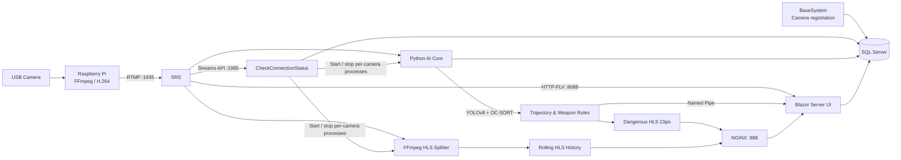

# HomeDefender

> 結合 YOLOv8、OC-SORT、即時串流與異常行為分析的社區安全警示系統

[繁體中文](./README.zh.md) | [English](./README.md)

HomeDefender 是一套端到端的智慧影像監控原型。系統由 Raspberry Pi 鏡頭端、Windows 伺服器、AI 影像分析核心與 Blazor Server 使用者介面組成，可接收即時影像、持續追蹤人物、辨識可疑軌跡與危險物品，並將即時警示及對應影像片段傳送給使用者。

本專案希望改善傳統監控高度依賴人工觀看、容易疲勞，以及單純移動偵測產生大量無意義通知的問題。系統不只判斷畫面中「有東西移動」，還會進一步分析人物是路過、駐足或徘徊，並判斷人物附近是否出現棍棒、刀或槍。

<p align="center">
  
</p>

## 主要功能

- 即時監看：透過 HTTP-FLV 播放各鏡頭的低延遲即時串流。
- 歷史影像：將串流切割成 HLS 片段，提供最近一段時間的影像回放。
- 人物追蹤：使用 YOLOv8 偵測物件，並由 OC-SORT 維持跨影格人物 ID。
- 軌跡分類：依人物的速度與轉向角度，分類為路過、駐足或徘徊。
- 危險物品辨識：辨識棍棒、刀與槍，並將武器與鄰近人物建立關聯。
- 即時警示：以 Named Pipe 將 AI 行程的事件傳送至已訂閱該鏡頭的 Web 工作階段。
- 危險片段保存：自動備份異常事件發生前後的 HLS 片段。
- 手動錄影：使用者可從即時串流頁面開始與結束錄製。
- 多使用者與多鏡頭：以鏡頭 ID 與金鑰管理存取權，同一鏡頭可分享給多位使用者。
- 自訂通知規則：可選擇危險分數門檻，或指定要接收的事件種類。
- 統計圖表：顯示各鏡頭近期的路過、駐足與徘徊事件數量。

## 系統架構

HomeDefender 可分為三個主要區塊：

1. **鏡頭端**：Raspberry Pi 擷取攝影機畫面，以 H.264 編碼後透過 RTMP 推流。
2. **伺服器端**：SRS 接收串流；監控程式依串流狀態啟停儲存及 AI 分析行程；SQL Server 保存使用者、鏡頭與事件資料；NGINX 對外提供 HLS 片段。
3. **使用者端**：Blazor Server 提供帳號、鏡頭、串流、事件、錄影、圖表及通知介面。

<p align="center">
  
</p>

### 影像與事件資料流



鏡頭首次啟動時，會先向 `BaseSystem` 傳送鏡頭 ID 與金鑰。伺服器完成資料庫及儲存目錄初始化後，鏡頭才開始推送 RTMP 串流。`CheckConnectionStatus` 持續讀取 SRS 的串流 API；當串流上線或離線時，會建立或終止該鏡頭專屬的影像儲存與 AI 分析行程。

<p align="center">
  
</p>

## AI 分析流程

每一幀影像大致依下列順序處理：

1. 自串流緩衝區取出影格。
2. 使用自訂 YOLOv8 權重偵測人物、棍棒、刀與槍。
3. 將人物偵測框送入 OC-SORT，取得跨影格一致的追蹤 ID。
4. 將武器偵測結果與重疊或鄰近的人物配對。
5. 依人物軌跡的速度、方向與累積角度判斷行為。
6. 計算危險分數，向符合使用者規則的工作階段發送通知。
7. 當異常人物離開畫面後，整理並保存完整危險片段。

### 軌跡分類

系統定義三種人物狀態：

| 狀態 | 說明 | 分數 |
| --- | --- | ---: |
| `pass` | 一般路過，未符合異常條件 | 0 |
| `wait` | 速度低於動態門檻，且軌跡角度變化符合駐足特徵 | 3 |
| `wander` | 仍在移動，但累積轉向幅度符合徘徊特徵 | 5 |

目前實作採用以角度為主、速度為輔的規則：

- 追蹤開始後略過最初數幀，降低物件剛進入畫面時偵測框抖動造成的雜訊。
- 每隔固定影格取樣位置並累積移動方向的角度差。
- 駐足判斷同時要求低速與足夠的角度變化。
- 徘徊判斷要求人物仍在移動，且累積轉向幅度超過門檻。
- 速度門檻會依人物偵測框寬度動態調整，以補償遠近造成的畫面尺度差異。

專案報告中的測試結果顯示，早期僅依速度極值分類的規則準確率為 **82.927%**，最終角度方案為 **95.683%**。

### 危險物品關聯

系統不會因畫面中單獨出現疑似武器就立即通知，而是先確認武器是否持續與某位人物的偵測框重疊：

- 至少累積 30 幀的關聯結果後才建立武器事件。
- 武器置信度同時考慮 YOLOv8 平均置信度與該武器在觀察影格中的出現比例。
- 若後續主要武器種類改變，且新種類占比超過門檻，系統會再次通知。

| 武器 | 額外分數 |
| --- | ---: |
| 無 | 0 |
| 棍棒 `bat` | 3 |
| 刀 `knife` | 4 |
| 槍 `gun` | 5 |

行為分數與武器分數相加後，形成 0～10 的危險分數。使用者可選擇：

- **分數模式**：事件分數高於自訂門檻時通知。
- **種類模式**：事件包含使用者勾選的 `wait`、`wander`、`bat`、`knife` 或 `gun` 時通知。

### YOLOv8 訓練結果

專案報告記錄的第三次模型調整結果如下：

| 類別 | AP50 |
| --- | ---: |
| Person | 0.864 |
| Bat | 0.797 |
| Knife | 0.544 |
| Gun | 0.980 |

> 以上數值來自專案報告中的實驗資料，並非本儲存庫每次執行時自動重現的 benchmark。實際結果會受到資料集、權重、硬體、串流品質與門檻設定影響。

## Web 介面

Blazor Server 使用者介面包含：

- 登入與註冊
- 使用者資料及通知模式設定
- 鏡頭新增、刪除、重新命名與共用者資訊
- 即時 HTTP-FLV 串流
- HLS 歷史影像
- 自動保存的危險片段
- 手動錄製片段
- 近期事件統計圖表
- 即時危險 Toast 通知

<p align="center">
  
</p>

## 專案結構

```text
.
├── assets/                    # README 使用的架構圖、流程圖與系統畫面
├── BaseSystem/                # .NET 6 鏡頭註冊 TCP 服務
│   └── BaseSystem/
│       ├── Program.cs         # 接收鏡頭 ID / key，初始化 SQL 與儲存目錄
│       └── SocketService.cs   # 早期 Socket 服務實驗版本
├── CheckConnectionStatus/     # SRS 串流狀態與子行程生命週期監控
│   └── CheckConnectionStatus/
│       └── Program.cs
├── BlazorApp1/                # .NET 6 Blazor Server 使用者介面
│   ├── Components/            # 播放器、表單、設定對話框與圖表
│   ├── Data/                  # SQL、Session、通知 Pipe 與設定服務
│   ├── Pages/                 # 登入、直播、歷史、危險片段、錄影、圖表
│   └── wwwroot/               # CSS、hls.js、mpegts.js 與前端 JavaScript
├── Core/                      # Python AI 推論、追蹤、規則與通知
│   ├── core.py                # 主要 YOLOv8 + OC-SORT 推論入口
│   ├── RiskWithAngle1.py      # 最終使用的軌跡分類規則
│   ├── Weapon.py              # 人物與武器關聯及置信度累積
│   ├── loads.py               # 串流讀取與影格緩衝
│   ├── NatificationSendThread.py
│   ├── StoreDangerousFragmentThread.py
│   ├── trackers/              # OC-SORT 等追蹤器
│   ├── weights/               # YOLO 與 ReID 權重
│   └── yolov8/                # 專案使用的 Ultralytics YOLOv8 原始碼
└── RaspberryPiC/              # Raspberry Pi Linux C/C++ edge 客戶端
    └── RaspberryPiC/
        ├── main.cpp           # 註冊、重連與 FFmpeg 推流
        └── config.example.txt # Server IP、port、camera ID 與 key 範例
```

## 技術棧

| 區域 | 技術 |
| --- | --- |
| Edge | Raspberry Pi、Linux、C/C++、V4L2、FFmpeg |
| 串流 | RTMP、HTTP-FLV、HLS、SRS、NGINX |
| AI | Python、PyTorch、YOLOv8、OC-SORT、OpenCV、NumPy |
| Server | .NET 6、C#、SQL Server、Named Pipe、FFmpeg |
| Web | ASP.NET Core Blazor Server、hls.js、mpegts.js、Chart.js |
| 部署 | Windows Server / IIS（原始專案環境） |

## 部署需求

這個儲存庫保存的是研究原型的完整程式快照，但目前**不是一鍵啟動專案**。部署前需要準備以下元件：

- Windows 伺服器
- .NET 6 SDK 或 Runtime
- SQL Server
- SRS，提供 RTMP、HTTP API 與 HTTP-FLV
- NGINX，提供 HLS 靜態檔案
- FFmpeg 與 FFprobe
- Python 3.9 環境
- PyTorch；正式即時分析建議使用 NVIDIA GPU 與對應 CUDA
- Raspberry Pi、UVC/V4L2 攝影機與 Raspberry Pi OS

模型檔案使用 Git LFS 管理：

```bash
git lfs install
git lfs pull
```

Python 除了 `Core/requirements.txt` 內列出的套件外，專案自有程式還使用：

```bash
pip install pymssql pythonnet ffmpeg-python
```

### 外部或缺少的部署資源

目前快照未包含下列必要項目，因此要完整啟動所有服務前需先補齊：

- SQL Server 建表及初始化腳本
- SRS 正式設定檔與 TLS 憑證
- NGINX 正式設定檔與 TLS 憑證
- `SubprocessHandler` 專案原始碼
- 由 `SubprocessHandler` 啟動的 HLS 儲存行程完整來源

`CheckConnectionStatus.csproj` 目前參考：

```text
../../SubprocessHandler/SubprocessHandler/SubprocessHandler.csproj
```

但該專案不在此儲存庫中。編譯此模組前，需還原原專案，或重新實作負責啟動及終止每鏡頭 AI/HLS 子行程的 `Runner` 與 `Killer`。

## 設定

請依照 `.env.example` 建立本機環境設定並替換範例值。包含敏感資訊的本機設定檔已由 `.gitignore` 排除。

啟動 Web 應用程式前，請將 `BlazorApp1/config.example.ini` 複製為 `BlazorApp1/config.ini`，並設定部署環境使用的對外網址。

| 設定位置 | 內容 |
| --- | --- |
| `.env.example` | 資料庫、SRS、儲存與 Python 環境變數範例 |
| `RaspberryPiC/RaspberryPiC/config.example.txt` | 鏡頭端 Server 位址、port、鏡頭 ID 與金鑰範例 |
| `BlazorApp1/config.example.ini` | Web、HLS 與 FLV 對外網址範例 |
| `BlazorApp1/appsettings.json` | 使用整合式驗證的安全 SQL Server 預設值 |

### 服務與連接埠

| 預設 port | 用途 |
| ---: | --- |
| `1935` | SRS RTMP ingest |
| `1985` | SRS HTTP API |
| `8088` | SRS HTTP-FLV |
| `888` | NGINX HLS |
| `25361` | Raspberry Pi 鏡頭註冊 TCP 服務 |
| `7143` / `5105` | Blazor 開發環境 HTTPS / HTTP |

### 資料庫

程式使用的主要資料表如下：

| 資料表 | 用途 |
| --- | --- |
| `camera_info` | 鏡頭 ID、金鑰、連線狀態與 IP |
| `storage_info` | 各鏡頭影像儲存路徑 |
| `process_info` | AI 與 HLS 儲存行程 PID |
| `user_info` | 帳號、密碼雜湊、通知模式與規則 |
| `user_cam` | 使用者與鏡頭存取權及自訂名稱 |
| `cam_danger` | 自動保存的危險片段時間範圍 |
| `cam_record` | 使用者手動錄製片段 |
| `IPC_table` | 鏡頭與 Blazor Named Pipe 訂閱者 |
| `danger_amount` | 每日軌跡事件統計 |

## 建議啟動順序

1. 建立 SQL Server 資料庫及資料表。
2. 建立每個鏡頭需要的 `dangerous/` 與 `record/` 儲存目錄。
3. 啟動 SRS，確認 RTMP、HTTP API 與 HTTP-FLV 可用。
4. 啟動 NGINX，將 `/live` 映射至 HLS 儲存根目錄。
5. 啟動 `BaseSystem` 鏡頭註冊服務。
6. 啟動 `CheckConnectionStatus` 串流及行程監控服務。
7. 啟動 `BlazorApp1`。
8. 在 Raspberry Pi 放置 `/home/pi/config.txt`，安裝 FFmpeg 後啟動 edge 程式。

### .NET 專案

```powershell
dotnet build .\BaseSystem\BaseSystem\BaseSystem.csproj
dotnet build .\BlazorApp1\BlazorApp1.csproj
dotnet run --project .\BaseSystem\BaseSystem\BaseSystem.csproj
dotnet run --project .\BlazorApp1\BlazorApp1.csproj
```

`CheckConnectionStatus` 需先補回 `SubprocessHandler`：

```powershell
dotnet run --project .\CheckConnectionStatus\CheckConnectionStatus\CheckConnectionStatus.csproj
```

### AI Core

```bash
cd Core
pip install -r requirements.txt
pip install pymssql pythonnet ffmpeg-python

python core.py \
  --source rtmp://127.0.0.1/live/<camera-key> \
  --cam-id <camera-id> \
  --g-key <camera-key> \
  --tracking-method ocsort
```

預設入口使用：

- `weights/best.pt`
- `weights/osnet_x0_25_msmt17.pt`
- `trackers/ocsort/configs/ocsort.yaml`

### Raspberry Pi

請將 `config.example.txt` 複製為 `/home/pi/config.txt`。檔案格式為四行：

```text
<server-ip>
<registration-port>
<camera-id>
<camera-key>
```

程式成功註冊後會執行概念上等同於下列設定的 FFmpeg 推流：

```bash
ffmpeg \
  -input_format h264 \
  -f video4linux2 \
  -s 1280x720 \
  -r 24 \
  -i /dev/video0 \
  -c:v copy \
  -b:v 1M \
  -an \
  -max_delay 10 \
  -g 6 \
  -threads 2 \
  -f flv \
  rtmp://<server-ip>/live/<camera-key>
```

## 授權與第三方專案

根目錄目前沒有獨立的專案授權聲明。`Core/` 中引用的 YOLOv8 tracking 程式附有 GPL-3.0 授權及 citation 資訊，其他內嵌函式庫也可能有各自的授權條款。

正式公開或再散布前，請：

1. 為 HomeDefender 自有程式加入明確的 `LICENSE`。
2. 保留所有第三方專案的授權與著作權聲明。
3. 確認自有程式採用的授權與 GPL-3.0 及其他相依套件相容。

主要相關專案：

- [Ultralytics YOLO](https://github.com/ultralytics/ultralytics)
- [OC-SORT](https://github.com/noahcao/OC_SORT)
- [Yolov8 Tracking / BoxMOT predecessor](https://github.com/mikel-brostrom/yolov8_tracking)
- [SRS](https://github.com/ossrs/srs)
- [FFmpeg](https://ffmpeg.org/)
- [ASP.NET Core Blazor](https://dotnet.microsoft.com/apps/aspnet/web-apps/blazor)

---

HomeDefender 為資訊工程專題研究成果，重點在於展示 edge 串流、即時多物件追蹤、異常行為規則、跨行程通知與完整 Web 監控介面的整合。
